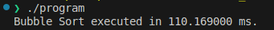
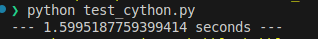
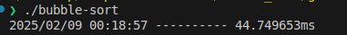
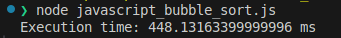
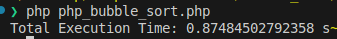
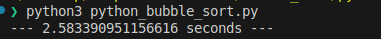
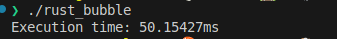

# Bubble Sort Benchmarks

## Description :books:
The idea of this repo is to check the performance of every language on using the bubble sort for an array of 10.000 numbers! I got that idea because i'm always curious about performance and how things work on low level and high level!

## Benchmarks :rocket:

### C

### C++

### Cython

### Go

### JavaScript

### PHP

### Python

### Rust

## Specs :anchor:
I'm using a laptop with the following specs:

- 12th Gen Intel® Core™ i7-1255U × 12.
- Ubuntu 22.04.5 LTS.
- 32GBs of Ram.
- 500GBs SSD.

## TO-DO :man_playing_handball:
- Adding
    - Java.
    - Kotlin.
    - Ruby.
    - C#.
    - Perl.
    - Dart.
    - Elixir.
    - Erlang.
    - Objective-C.
    - Scala.
    - Lua.
    - Powershell.
    - Bach.
    - Ocaml.

## LICENSE :balance_scale:

This project is licensed under the MIT License. See the [LICENSE](https://github.com/AAVision/bubble-sort-benchmarks/blob/main/LICENSE) file for details.